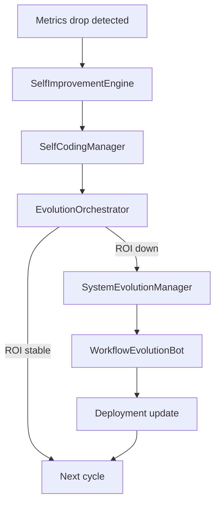

# Evolution Pipeline Flow

The diagram below summarizes how Menace adapts itself when metrics degrade.

The process begins when `DataBot` notices an error spike or low energy score.
`EvolutionOrchestrator` chooses between running a self‑improvement cycle or a
larger structural evolution. Predictions from `EvolutionPredictor` guide the
choice. When structural changes succeed the updated bots are redeployed and the
loop starts again.
