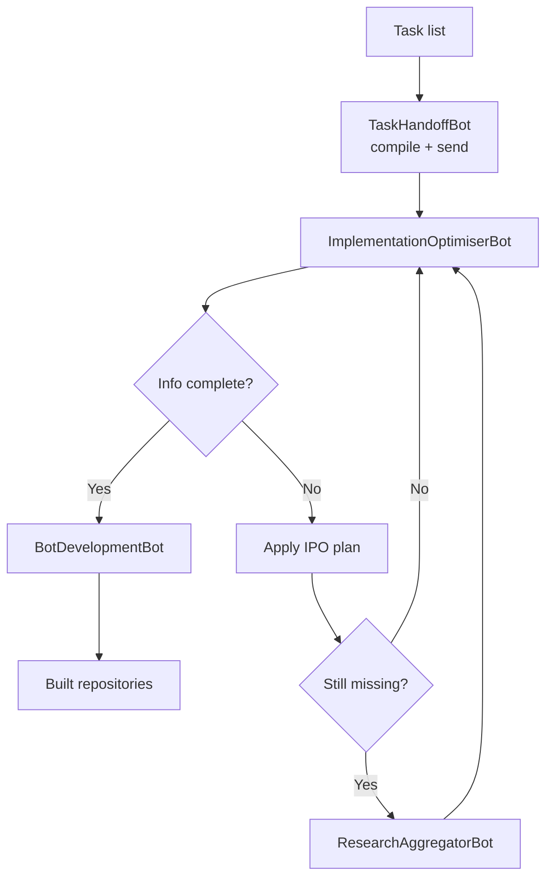

# Implementation Pipeline

`ImplementationPipeline` orchestrates the conversion of high level planning tasks into runnable bot code. It chains together three helper bots:

1. **TaskHandoffBot** – compiles the raw task list into a `TaskPackage`, records the workflow in `WorkflowDB` and transmits the package to Stage 4 via HTTP or an optional message queue.
2. **ImplementationOptimiserBot** – fills in missing metadata or code snippets and tidies Python implementations using simple AST transforms. See [implementation_optimiser_bot.md](implementation_optimiser_bot.md) for details.
3. **BotDevelopmentBot** – generates the actual bot repository for each task, writing starter code files and committing them to a local git repo.

The pipeline can optionally invoke `ResearchAggregatorBot` or `IPOBot` when additional information or execution plans are required.

## Overview



### Stage descriptions

1. **TaskHandoffBot** – stores the task package in `WorkflowDB` and attempts to hand it off to Stage 4.
2. **ImplementationOptimiserBot** – infers missing metadata and converts the package into a buildable plan.
3. **IPOBot** (optional) – generates an execution plan if optimiser output lacks detail.
4. **ResearchAggregatorBot** (optional) – supplies context when a plan cannot be completed automatically.
5. **BotDevelopmentBot** – builds the repositories, executes `scripts/setup_tests.sh` and runs `pytest` inside each one. If any tests fail an error is raised and logged.

### Typical failure scenarios

- **Handoff failure** – network errors when contacting Stage 4 cause retries. After two failed attempts the pipeline aborts.
- **IPO plan failure** – if `IPOBot.generate_plan` raises an exception twice, the run stops.
- **Research failure** – problems while invoking the researcher are logged and cause the pipeline to raise.
- **Build failure** – the developer bot may fail to generate code, leading to a
  runtime error.
- **Test failure** – if `pytest` fails for a generated repository the pipeline raises an error and logs the output.

## Usage

```python
from menace.implementation_pipeline import ImplementationPipeline
from menace.task_handoff_bot import TaskInfo

pipeline = ImplementationPipeline()

tasks = [
    TaskInfo(
        name="DemoBot",
        dependencies=[],
        resources={},
        schedule="once",
        code="print('hello')",
        metadata={"purpose": "demo", "functions": ["run"]},
    )
]

result = pipeline.run(tasks)
print(result.built_files)
```

`result.built_files` contains the paths of the generated bot files while `result.package` is the final `TaskPackage` processed by the pipeline.
All repositories are verified by running `scripts/setup_tests.sh` followed by `pytest`. A ``RuntimeError`` is raised if the tests fail.

## Configuration

`BotDevelopmentBot` reads several environment variables via `BotDevConfig`:

- `BOT_DEV_REPO_BASE` – directory where generated repos are created (default `dev_repos`).
- `BOT_DEV_ES_URL` – optional Elasticsearch instance used for pattern suggestions.
- `BOT_DEV_HEADLESS` – set to `1` to disable interactive windows and run in
  headless mode.
 - `BOT_DEV_CONCURRENCY` – number of concurrent workers used during code generation.
 - `SELF_CODING_INTERVAL` – run `SelfCodingEngine` after this many cycles (default `5`).

### SelfCodingEngine

`BotDevelopmentBot` now generates code locally through `SelfCodingEngine`.
Configure intervals and thresholds via `SELF_CODING_INTERVAL`,
`SELF_CODING_ROI_DROP` and `SELF_CODING_ERROR_INCREASE`. All generation runs
offline and no external API keys are required. Provide a custom engine by
instantiating ``SelfCodingEngine`` and passing it to ``BotDevelopmentBot``:

```python
from bot_development_bot import BotDevelopmentBot
from self_coding_engine import SelfCodingEngine
from menace_memory_manager import MenaceMemoryManager

memory_mgr = MenaceMemoryManager()
engine = SelfCodingEngine("code.db", memory_mgr, context_builder=builder)
bot = BotDevelopmentBot(context_builder=builder, engine=engine)
```

`TaskHandoffBot` accepts an `api_url` parameter to change the HTTP endpoint used for Stage 4 handoff. Message queue integration can be enabled by providing a `pika` channel instance.

### Optional components

`ResearchAggregatorBot` forwards collected findings to Stage 3 when `STAGE3_URL` is set:

```python
from menace.research_aggregator_bot import ResearchAggregatorBot
from vector_service.context_builder import ContextBuilder

ctx = ContextBuilder("bots.db", "code.db", "errors.db", "workflows.db")
researcher = ResearchAggregatorBot(["security", "optimisation"], context_builder=ctx)
```
Start the helper FastAPI app in `stage3_service.py` to collect these findings.
Set ``STAGE3_URL`` to the endpoint (for the default port use
``STAGE3_URL=http://localhost:8000/stage3``):

```bash
uvicorn stage3_service:app
```

`IPOBot` requires access to a models database and an enhancements database:

```python
from menace.ipo_bot import IPOBot
from vector_service.context_builder import ContextBuilder

builder = ContextBuilder()
ipo = IPOBot(
    db_path="models.db",
    enhancements_db="enhancements.db",
    context_builder=builder,
)

pipeline = ImplementationPipeline(researcher=researcher, ipo=ipo)
```

