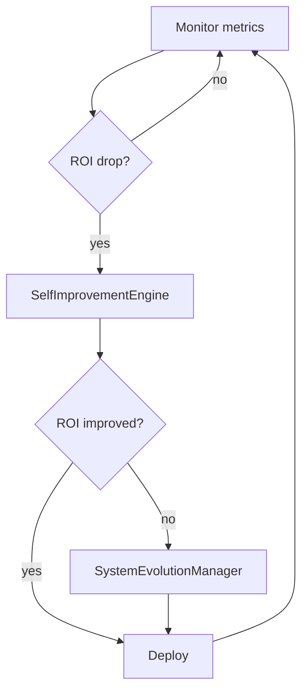

# Quickstart

This guide walks you through the common Menace workflows using the new `menace` CLI.

## Step-by-step setup

1. **Clone the repository**
   ```bash
   git clone https://example.com/menace_sandbox.git
   cd menace_sandbox
   ```
2. **Install dependencies**
   ```bash
   menace setup
   ```
   The command wraps `scripts/setup_autonomous.sh` and creates a basic `.env` file.
   This installs all required packages, including the `foresight_tracker`
   module used for stability forecasting. The generated file includes stub
   values for critical settings:

   - `DATABASE_URL` defaults to `sqlite:///menace.db`
   - `SANDBOX_DATA_DIR` defaults to `sandbox_data` (use `resolve_path` when referencing files)
   - `PROMPT_CHUNK_TOKEN_THRESHOLD` and `PROMPT_CHUNK_CACHE_DIR` control code
     chunking token limits and caching for large file summaries

    Resolve paths with `dynamic_path_router.resolve_path` so configurations
    remain portable and avoid embedding path literals:

    ```python
    import os
    from dynamic_path_router import resolve_path
    data_dir = resolve_path(os.getenv("SANDBOX_DATA_DIR", "sandbox_data"))
    ```

    Override the repository root with `SANDBOX_REPO_PATH`:

    ```bash
    SANDBOX_REPO_PATH=/alt/clone python - <<'PY'
    from dynamic_path_router import resolve_path
    print(resolve_path('README.md'))
    PY
    ```

    For multi‑repo builds, `MENACE_ROOTS` or `SANDBOX_REPO_PATHS` may specify a
    `os.pathsep`‑separated list of roots. Pass a repository name or path via
    `resolve_path(..., root="other_repo")` to target a specific checkout:

    ```bash
    MENACE_ROOTS="/repo/main:/repo/fork" python - <<'PY'
    from dynamic_path_router import resolve_path
    print(resolve_path('README.md', repo_hint='/repo/fork'))
    PY
    ```
3. **Run the tests** (optional)
   ```bash
   menace test
   ```
4. **Start the self‑optimisation loop**
   ```bash
   menace sandbox run --preset-count 3
   ```
5. **Benchmark workflows**
   ```bash
   menace benchmark
   ```
6. **Deploy the updated bots**
   ```bash
   menace deploy
   ```

### Utility commands

```bash
# Semantic search with caching and full-text fallback
menace retrieve "missing config" --db code

# Emit raw JSON instead of a table
menace retrieve "missing config" --db code --json

# Apply a patch using the self-coding engine
menace patch bots/example.py --desc "handle edge case"

# Backfill embeddings for a specific database
menace embed --db workflows

# Scaffold a new database module and test
menace new-db demo
```

`retrieve` caches results on disk and reuses them until the underlying databases change. When the vector retriever raises an error, database-specific full-text helpers are consulted as a fallback.

### Precomputing summaries

Populate the summary cache ahead of time to avoid first‑run latency:

```python
from pathlib import Path
from chunking import get_chunk_summaries

# Populate chunk_summary_cache/ with summaries
get_chunk_summaries(Path("bots/example.py"), 800)
```

When building prompts the self‑coding engine loads these summaries and passes
them to the prompt engine:

```python
from pathlib import Path
from chunking import get_chunk_summaries
from prompt_engine import PromptEngine
from vector_service.context_builder import ContextBuilder

engine = PromptEngine(context_builder=ContextBuilder())
chunks = get_chunk_summaries(Path("bots/example.py"), 800)
prompt = engine.build_prompt(
    "refactor helper",
    summaries=[c["summary"] for c in chunks],
    context_builder=engine.context_builder,
)
```

### Recursive module discovery

Passing modules are merged into the sandbox automatically and a simple
workflow is generated for each one. To discover orphaned modules and their
dependencies recursively, run:

```bash
menace sandbox run --discover-orphans --auto-include-isolated \
    --recursive-include --recursive-isolated --clean-orphans
```

`--auto-include-isolated` sets `SANDBOX_AUTO_INCLUDE_ISOLATED=1` and
`--recursive-include` enables `SANDBOX_RECURSIVE_ORPHANS=1`, causing
`sandbox_runner.discover_recursive_orphans` to follow import chains and append
non‑redundant modules to `sandbox_data/module_map.json`. One‑step workflows are
created automatically so the new code participates in subsequent runs. The
[recursive orphan workflow](recursive_orphan_workflow.md) document covers these
environment variables in more detail.

## Troubleshooting

- **Missing packages** – run `menace setup` again to reinstall requirements.
- **Tests fail** – ensure optional tools like `ffmpeg` and Docker are installed.
- **Dashboard not loading** – check that `AUTO_DASHBOARD_PORT` is free.
- **Visual agent 401 errors** – verify `VISUAL_AGENT_TOKEN` matches your `.env`.

## Self‑Optimisation Loop



The loop runs continuously until stopped. Metrics are collected each cycle and the
system decides whether to apply a simple improvement or perform a structural evolution.
