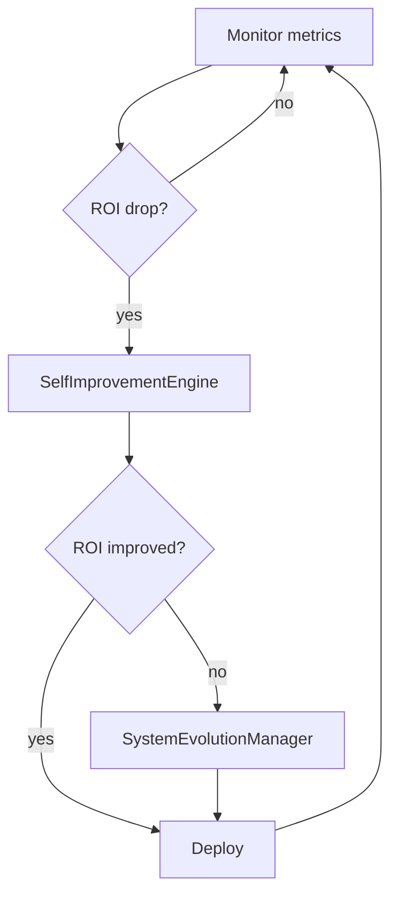

# Quickstart

This guide walks you through the common Menace workflows using the new `menace` CLI.

## Step-by-step setup

1. **Clone the repository**
   ```bash
   git clone https://example.com/menace_sandbox.git
   cd menace_sandbox
   ```
2. **Install dependencies**
   ```bash
   menace setup
   ```
   The command wraps `scripts/setup_autonomous.sh` and creates a basic `.env` file.
3. **Run the tests** (optional)
   ```bash
   menace test
   ```
4. **Start the self‑optimisation loop**
   ```bash
   menace sandbox run --preset-count 3
   ```
5. **Benchmark workflows**
   ```bash
   menace benchmark
   ```
6. **Deploy the updated bots**
   ```bash
   menace deploy
   ```

## Troubleshooting

- **Missing packages** – run `menace setup` again to reinstall requirements.
- **Tests fail** – ensure optional tools like `ffmpeg` and Docker are installed.
- **Dashboard not loading** – check that `AUTO_DASHBOARD_PORT` is free.
- **Visual agent 401 errors** – verify `VISUAL_AGENT_TOKEN` matches your `.env`.

## Self‑Optimisation Loop



The loop runs continuously until stopped. Metrics are collected each cycle and the
system decides whether to apply a simple improvement or perform a structural evolution.
